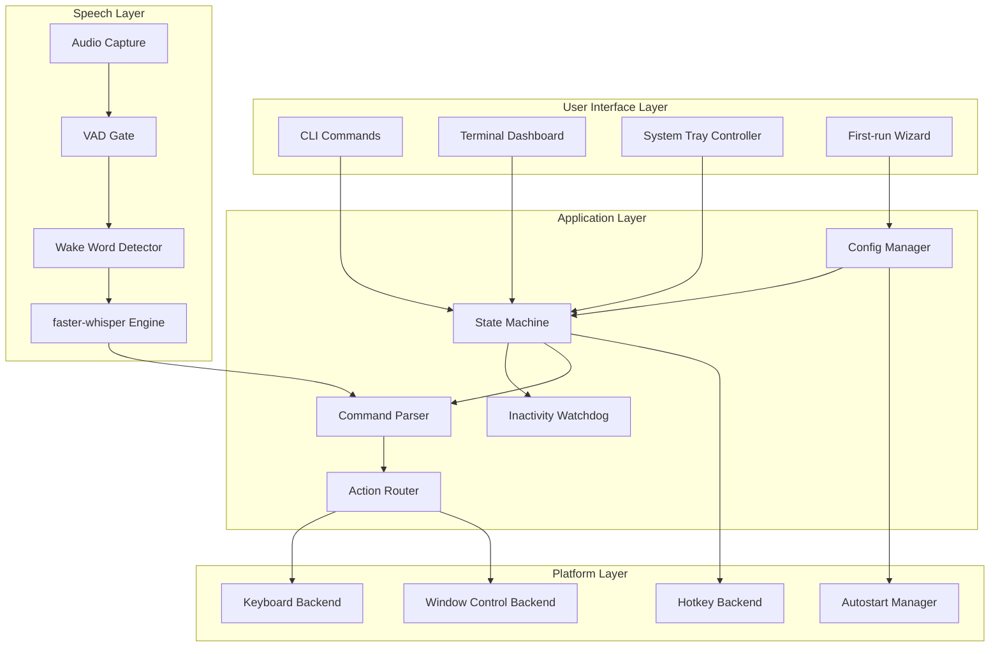
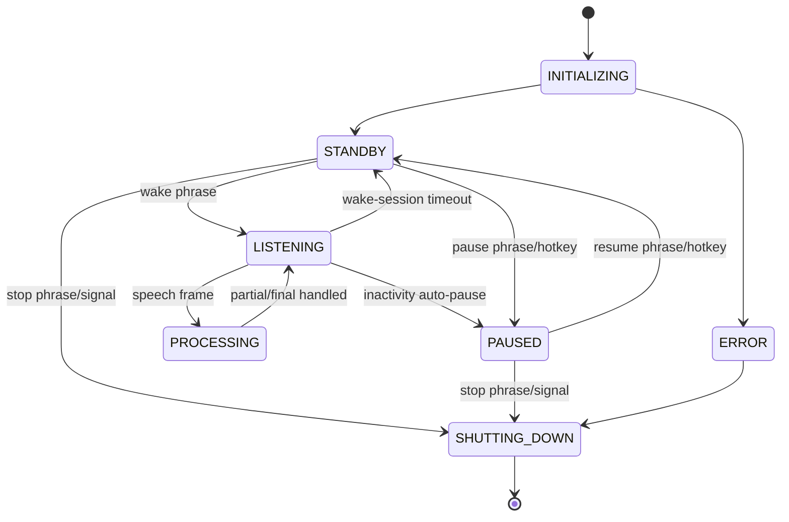

# VoiceKey Architecture Specification
## World-class Offline Voice Keyboard Architecture

> Version: 2.0 (Aligned)
> Last Updated: 2026-02-19

---

## 1. Architecture Goals

1. Deliver low-latency voice typing that feels immediate.
2. Maximize safety against accidental typing.
3. Run fully offline after model download.
4. Work reliably across Linux and Windows.
5. Support both CLI users and background tray users.

---

## 2. System Context

VoiceKey runs as a local desktop process and interacts with:

- microphone input devices
- OS keyboard injection APIs
- OS global hotkey APIs
- system tray runtime
- local model storage

No cloud APIs are used in the runtime speech pipeline.

---

## 3. High-level Component Architecture



---

## 4. Runtime Data Flow

### 4.1 Primary Flow

1. Audio capture callback pushes frames into an in-memory queue.
2. VAD classifies speech vs silence.
3. Wake detector listens for `voice key` while in `STANDBY`.
4. On wake event, ASR engine processes speech chunks.
5. Parser classifies transcript into text/command/system-action.
6. Action router sends keyboard/window actions to platform backends.
7. Watchdog resets or expires listening session based on inactivity timers.

### 4.2 Command Parsing Contract

- If transcript ends with `command`, strip suffix and attempt command match.
- If no command match: emit literal text including `command`.
- Special phrases bypass suffix rule:
  - `pause voice key`
  - `resume voice key`
  - `voice key stop`

---

## 5. State Machine



### 5.1 Safety Timers

- `wake_window_timeout_seconds` (default 5)
- `inactive_auto_pause_seconds` in toggle/continuous mode (default 30)
- silence accounting driven by VAD + transcript inactivity

---

## 6. ASR and Speech Stack

### 6.1 Selected Stack

- ASR: faster-whisper (CTranslate2 backend)
- VAD: local VAD (Silero class or equivalent)
- Audio IO: sounddevice/PortAudio

### 6.2 Model Profiles

| Profile | Default Use | Tradeoff |
|--------|-------------|----------|
| tiny | low-end machines | fastest, lowest accuracy |
| base | default | balanced |
| small | high-accuracy local mode | higher resource use |

### 6.3 Why not FFmpeg in core pipeline

- Real-time microphone flow already uses PCM frames via PortAudio.
- FFmpeg remains optional for offline file diagnostics/import.

---

## 7. Platform Abstraction

### 7.1 Interfaces

```python
class KeyboardBackend(ABC):
    def type_text(self, text: str, delay_ms: int) -> None: ...
    def press_key(self, key: str) -> None: ...
    def press_combo(self, keys: list[str]) -> None: ...

class HotkeyBackend(ABC):
    def register(self, hotkey: str, callback: Callable[[], None]) -> None: ...
    def unregister(self, hotkey: str) -> None: ...

class WindowBackend(ABC):
    def maximize_active(self) -> None: ...
    def minimize_active(self) -> None: ...
    def close_active(self) -> None: ...
    def switch_next(self) -> None: ...
```

### 7.2 Linux Strategy

- Primary: X11-friendly path with pynput and hotkey backend.
- Fallback: evdev/uinput where allowed.
- Wayland: best effort with warning and reduced guarantees.

### 7.3 Windows Strategy

- Primary: pynput win32 path.
- Fallback: pywin32 SendInput path for edge compatibility.

---

## 8. System Tray and Background Service

### 8.1 Tray State Mapping

- `STANDBY` -> yellow icon
- `LISTENING` -> green icon
- `PAUSED` -> blue icon
- `ERROR` -> red icon
- `SHUTTING_DOWN` -> gray icon

### 8.2 Tray Actions

- Start / Stop
- Pause / Resume
- Open terminal dashboard
- Open config
- Exit

### 8.3 Daemon Mode

- `voicekey start --daemon` starts headless with tray.
- foreground dashboard remains optional.

---

## 9. Autostart Architecture

| Platform | Mechanism |
|----------|-----------|
| Windows | HKCU Run key |
| Linux Desktop | `~/.config/autostart/voicekey.desktop` |
| Linux systemd-user | `~/.config/systemd/user/voicekey.service` |

Autostart settings are controlled from config and onboarding wizard.

---

## 10. Configuration Architecture

### 10.1 Validation

- Schema validated at load (Pydantic recommended).
- Unknown keys logged as warnings.
- Invalid values fail-safe to defaults and surface warning.

### 10.2 Hot Reload Semantics

- Safe-to-reload keys: thresholds, timers, hotkeys, feedback.
- Restart-required keys: ASR model profile, backend selection.

---

## 11. Error Recovery Architecture

### 11.1 Error Categories

- Audio errors (device unavailable/disconnect)
- Recognition errors (model unavailable/runtime failure)
- Injection errors (permission or blocked target app)
- Config errors (parse/schema)

### 11.2 Recovery Policies

- Bounded retries for recoverable runtime errors.
- Automatic transition to `PAUSED` when safety cannot be guaranteed.
- Always provide explicit remediation in tray and CLI output.

---

## 12. Security and Privacy Design

1. No transcript persistence by default.
2. No raw audio persistence.
3. No outbound network calls during normal runtime.
4. Optional debug logging redacts recognized text by default.
5. Local model checksums verified before activation.

---

## 13. Performance Engineering Strategy

### 13.1 Latency Controls

- bounded frame chunking (100-200ms)
- lock-free or low-contention queues where possible
- background typing dispatcher
- model warm-up on startup
- avoid dynamic allocations in hot path

### 13.2 Budget Targets

- p50 end-to-end <= 200ms
- p95 end-to-end <= 350ms
- idle CPU <= 5%

---

## 14. Test Architecture

### 14.1 Unit

- parser correctness and fallback behavior
- state transitions and timer behavior
- config validation and migration

### 14.2 Integration

- end-to-end mic -> text -> injected keys
- tray actions and state synchronization
- autostart installation/uninstallation per OS

### 14.3 Performance

- latency percentiles across model profiles
- CPU/memory profiling for low-end and recommended hardware

### 14.4 Platform Compatibility

- Linux X11/Wayland matrix
- Windows standard/admin matrix

---

## 15. Build and Release Architecture

### 15.1 CI/CD Flow


### 15.2 PR CI Responsibilities

- static checks (format/lint/type)
- unit + integration smoke tests
- Linux and Windows matrix test jobs
- dependency vulnerability scan

### 15.3 Release CI Responsibilities

- build from clean tag only
- produce versioned artifacts with metadata
- sign artifacts and publish checksums
- run post-build install and startup smoke tests

---

## 16. Distribution Architecture

### 16.1 Artifact Matrix

| Target | Artifact | Notes |
|--------|----------|-------|
| PyPI | wheel + sdist | canonical Python channel |
| Windows | signed installer + portable zip | tray/autostart integration |
| Linux | AppImage + pip | broad desktop compatibility |

### 16.2 Model Distribution Strategy

- runtime model download with checksum verification
- optional prefetch command for offline prep
- model cache kept outside application binaries

---

## 17. Implementation-ready Module Layout

```text
voicekey/
  app/
    main.py
    state_machine.py
    watchdog.py
  audio/
    capture.py
    vad.py
    wake.py
    asr_faster_whisper.py
  commands/
    parser.py
    registry.py
    builtins.py
  actions/
    router.py
    keyboard_dispatch.py
    window_dispatch.py
  platform/
    keyboard_linux.py
    keyboard_windows.py
    hotkey_linux.py
    hotkey_windows.py
    window_linux.py
    window_windows.py
    autostart_linux.py
    autostart_windows.py
  ui/
    cli.py
    dashboard.py
    tray.py
    onboarding.py
  config/
    schema.py
    manager.py
    migration.py
  models/
    catalog.py
    downloader.py
    checksum.py
  tests/
    unit/
    integration/
    perf/
  .github/
    workflows/
      ci.yml
      release.yml
```

---

*Document Version: 2.1*  
*Last Updated: 2026-02-19*
