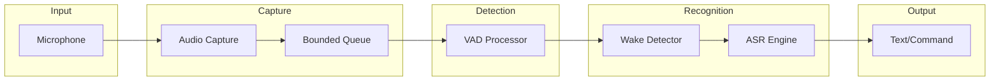
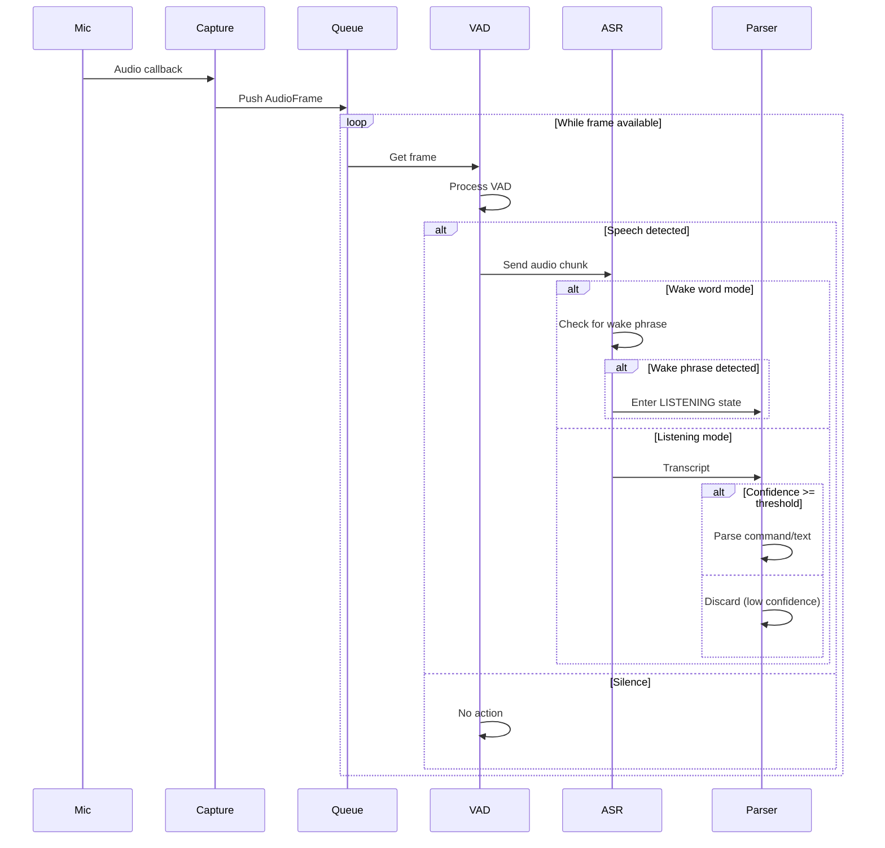

# Audio Pipeline

VoiceKey's audio pipeline processes microphone input through several stages to convert speech to text.

## Pipeline Overview



## Stage 1: Audio Capture

### Description

The audio capture module uses `sounddevice` (PortAudio) to capture real-time audio from the microphone.

### Key Characteristics

- **Sample Rate:** 16kHz (configurable)
- **Channels:** Mono
- **Format:** PCM float32
- **Chunk Duration:** 100ms (configurable)
- **Queue Size:** 32 frames (bounded)

### Implementation

```python
# voicekey/audio/capture.py

class AudioCapture:
    """Real-time microphone capture with low-latency callback."""
    
    def __init__(
        self,
        device: Optional[int] = None,
        sample_rate: int = 16000,
        chunk_duration: float = 0.1,
        queue_size: int = 32,
    ):
        ...
    
    def start(self) -> None:
        """Start audio capture."""
        ...
    
    def get_frame(self, timeout: float = 1.0) -> Optional[AudioFrame]:
        """Get next audio frame from queue."""
        ...
```

### Error Handling

| Error | Handling |
|-------|----------|
| Device not found | Show available devices, suggest selection |
| Device busy | Recommend closing other apps |
| Device disconnected | Auto-reconnect with backoff |

## Stage 2: Voice Activity Detection (VAD)

### Description

The VAD processor determines whether audio contains speech or silence. This reduces CPU usage by filtering out silence before ASR.

### Technology

- **Primary:** Silero VAD
- **Fallback:** Energy-based detection

### Configuration

```python
class VADProcessor:
    def __init__(
        self,
        threshold: float = 0.5,        # Speech detection threshold
        min_speech_duration: float = 0.1,  # Min speech duration
    ):
        ...
```

### VAD Result

```python
@dataclass
class VADResult:
    is_speech: bool      # True if speech detected
    confidence: float     # Confidence 0.0-1.0
```

### Benefits

- Reduces false wake triggers from background noise
- Lowers ASR processing load
- Improves overall latency

## Stage 3: Speech Recognition

### Wake Word Detection

When in STANDBY state, the pipeline monitors for the wake phrase ("voice key" by default).

**Process:**
1. VAD detects speech
2. Audio is buffered
3. ASR processes buffered audio
4. If wake phrase detected → transition to LISTENING

### ASR Processing

When in LISTENING state, audio is processed through faster-whisper.

**Configuration:**

```python
# Model profiles
model_profiles = {
    "tiny": {"size": "~39 MB", "accuracy": "low", "speed": "fastest"},
    "base": {"size": "~74 MB", "accuracy": "medium", "speed": "fast"},
    "small": {"size": "~244 MB", "accuracy": "high", "speed": "moderate"},
}
```

**Output:**

```python
@dataclass
class Transcript:
    text: str                 # Recognized text
    confidence: float          # 0.0-1.0
    is_partial: bool          # True if partial result
    language: str             # Detected language
```

## Pipeline Flow



## Performance Optimization

### 1. Bounded Queue with Backpressure

When the queue is full, new frames are dropped to prevent memory growth:

```python
try:
    self._queue.put_nowait(frame)
except queue.Full:
    logger.warning("Audio queue full, dropping frame")
```

### 2. Chunked Processing

Audio is processed in 100ms chunks (configurable) for optimal latency:

- Too small: High overhead
- Too large: Increased latency

### 3. Lazy Model Loading

ASR and VAD models are loaded on first use, not at startup:

```python
def _load_model(self) -> None:
    """Load model lazily on first use."""
    if not self._model_loaded:
        self._model, _ = vad()
        self._model_loaded = True
```

### 4. Background Dispatching

Keyboard events are dispatched in a background thread:

```python
def _type_text_background(self, text: str) -> None:
    """Type text in background thread."""
    thread = threading.Thread(target=self._type_text, args=(text,))
    thread.daemon = True
    thread.start()
```

## Latency Breakdown

| Stage | Target | Notes |
|-------|--------|-------|
| Audio capture | ~10ms | Depends on chunk duration |
| VAD detection | ~5ms | Silero is fast |
| Wake detection | ~50ms | Requires buffering |
| ASR processing | ~150ms | Model-dependent |
| Text injection | ~5ms | Platform-dependent |
| **Total (listening)** | **~200ms** | p50 target |
| **Total (wake)** | **~300ms** | Including wake detection |

## Troubleshooting

### High Latency

- Reduce chunk duration (minimum 0.05s)
- Use smaller ASR model (tiny instead of base)
- Close other audio applications

### VAD Too Sensitive

- Increase VAD threshold
- Increase min_speech_duration

### Audio Dropouts

- Check microphone quality
- Reduce queue size
- Increase buffer sizes

---

See also: [Architecture Overview](overview.md), [State Machine](state-machine.md)
