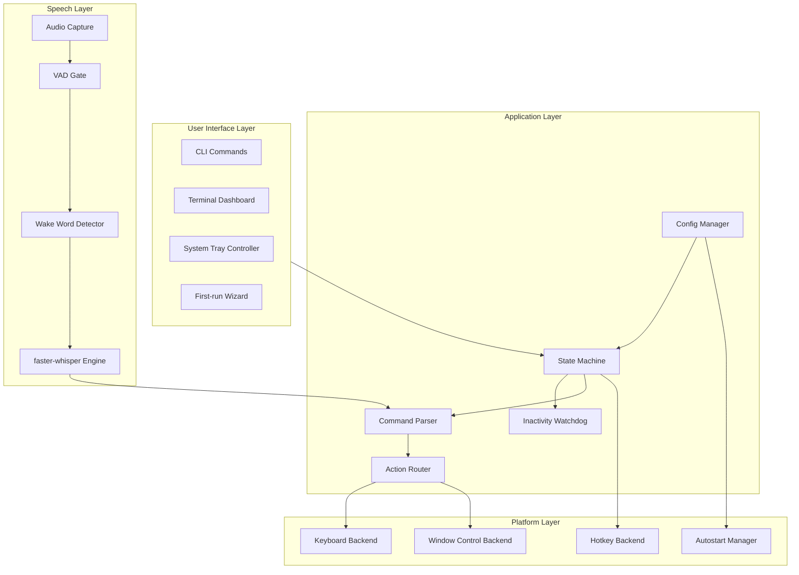
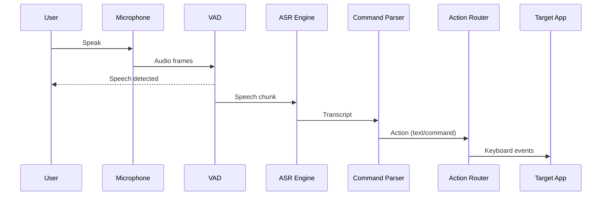
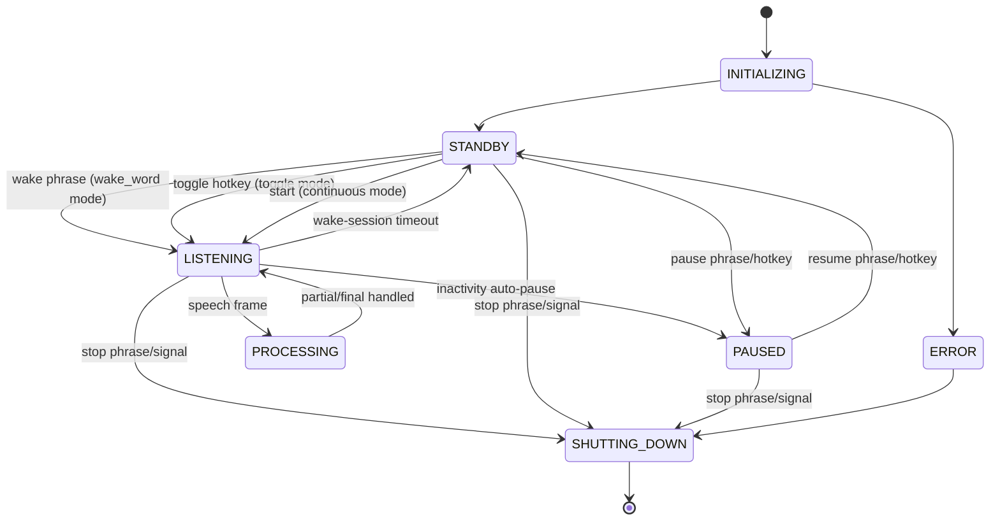
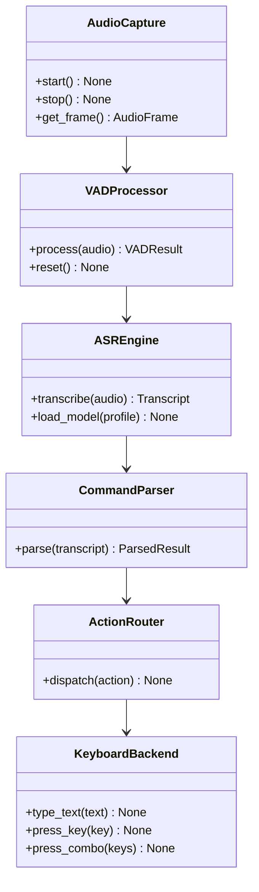

# Architecture Overview

VoiceKey is built with a modular, layer-based architecture designed for performance, reliability, and maintainability.

## System Context

VoiceKey runs as a local desktop process and interacts with:

- **Microphone Input** — Captures audio via sounddevice/PortAudio
- **OS Keyboard APIs** — Injects keystrokes into focused applications
- **OS Hotkey APIs** — Registers global keyboard shortcuts
- **System Tray** — Provides background service UI
- **Local Storage** — Stores configuration and cached models

No cloud APIs are used during the speech recognition pipeline.

## High-Level Architecture

## Layer Responsibilities

### UI Layer

Handles all user-facing interfaces:

- **CLI** — Command-line interface for starting, configuring, and controlling VoiceKey
- **Dashboard** — Terminal-based real-time status display
- **Tray** — System tray icon with context menu
- **Wizard** — First-run setup guided experience

### Application Layer

Core application logic:

- **State Machine** — Manages application states (STANDBY, LISTENING, PROCESSING, PAUSED, etc.)
- **Config Manager** — Loads, validates, and persists configuration
- **Command Parser** — Parses recognized text into text/commands/system-actions
- **Inactivity Watchdog** — Monitors user inactivity and auto-pauses
- **Action Router** — Dispatches actions to appropriate platform backends

### Speech Layer

Handles all audio processing:

- **Audio Capture** — Real-time microphone capture with low-latency callback
- **VAD** — Voice Activity Detection to filter silence
- **Wake Word Detector** — Detects activation phrase
- **ASR Engine** — Speech-to-text using faster-whisper

### Platform Layer

Abstracts platform-specific implementations:

- **Keyboard Backend** — Platform-specific keyboard injection
- **Hotkey Backend** — Global hotkey registration
- **Window Control** — Window management commands
- **Autostart Manager** — Platform-specific auto-start setup

## Data Flow

## State Machine

VoiceKey operates in the following states:

## Key Design Principles

### 1. Safety First

- Unknown commands type literally (nothing is silently dropped)
- Pause/resume works without wake word
- Inactivity auto-pause prevents accidental typing
- Wake window timeout prevents hung listening sessions

### 2. Privacy by Default

- No network calls during normal runtime
- No audio or transcript persistence
- Optional debug logging with redaction
- Local model verification

### 3. Performance Optimization

- Bounded queues with backpressure
- Lazy model loading
- Background typing dispatcher
- Minimal allocations in hot path

### 4. Platform Abstraction

- Clean interface definitions for platform backends
- Graceful degradation on unsupported features
- Platform-specific fallbacks where available

## Technology Stack

| Layer | Technology |
|-------|------------|
| ASR Engine | faster-whisper (CTranslate2) |
| Audio Capture | sounddevice (PortAudio) |
| VAD | Silero VAD |
| Keyboard Injection | pynput, evdev (Linux), pywin32 (Windows) |
| CLI | Click |
| Terminal UX | Rich |
| System Tray | pystray |
| Config | Pydantic + YAML |

## Component Diagram

## Performance Characteristics

| Metric | Target | Acceptable |
|--------|--------|------------|
| Wake Detect Latency | ≤100ms | ≤150ms |
| ASR Processing (chunk) | ≤150ms | ≤220ms |
| Command Parse/Dispatch | ≤10ms | ≤20ms |
| End-to-End Speech-to-Type | ≤200ms p50 | ≤350ms p95 |
| Idle CPU | ≤5% | — |
| Active CPU | ≤35% | — |
| Memory (model dependent) | ≤300MB | — |

## Error Handling

VoiceKey implements comprehensive error handling:

- **Audio Errors** — Auto-reconnect with backoff, transition to paused on failure
- **Recognition Errors** — Fail-safe to text mode, show user feedback
- **Injection Errors** — Clear permission guidance, graceful degradation
- **Config Errors** — Fail-safe to defaults, warn user

## See Also

- [Design Decisions](design-decisions.md)
- [State Machine](state-machine.md)
- [Audio Pipeline](audio-pipeline.md)
