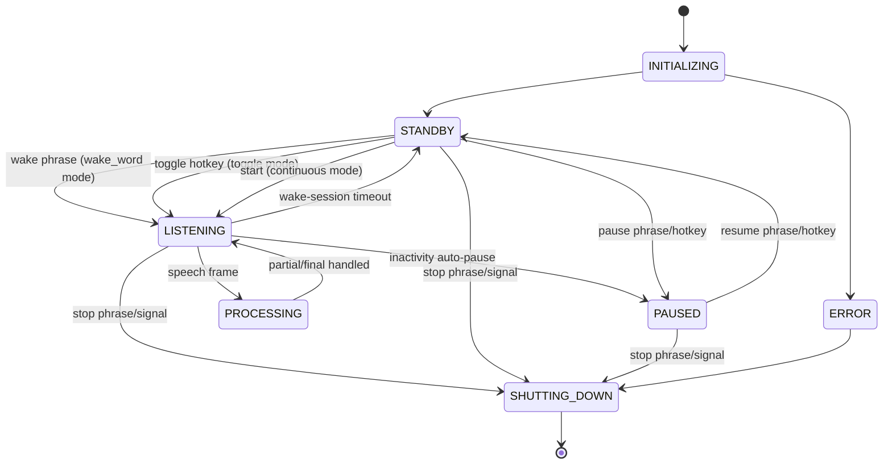

# State Machine

VoiceKey uses a Finite State Machine (FSM) to manage its operational states and transitions.

## State Overview

| State | Description | Icon Color |
|-------|-------------|------------|
| `INITIALIZING` | Application starting up | Gray |
| `STANDBY` | Ready, waiting for activation | Yellow |
| `LISTENING` | Actively listening for speech | Green |
| `PROCESSING` | Processing recognized speech | Green |
| `PAUSED` | Voice recognition paused | Blue |
| `ERROR` | Error state, needs attention | Red |
| `SHUTTING_DOWN` | Application shutting down | Gray |

## State Diagram



## State Descriptions

### INITIALIZING

The application is starting up and initializing all components:

- Loading configuration
- Initializing audio capture
- Loading ASR models
- Setting up platform backends

**Transitions:**
- → `STANDBY` on success
- → `ERROR` on initialization failure

### STANDBY

VoiceKey is ready and waiting for activation. This is the default idle state.

**Behavior:**
- Monitoring for wake phrase (wake_word mode)
- Listening for toggle hotkey (toggle mode)
- Monitoring for special phrases (`pause voice key`, `voice key stop`)

**Transitions:**
- → `LISTENING` on wake phrase detection
- → `LISTENING` on toggle hotkey
- → `LISTENING` on start in continuous mode
- → `PAUSED` on pause phrase/hotkey
- → `SHUTTING_DOWN` on stop signal

### LISTENING

VoiceKey is actively listening for speech input.

**Behavior:**
- Capturing audio
- Running VAD detection
- Sending audio to ASR engine
- Displaying partial transcripts

**Transitions:**
- → `PROCESSING` on speech detection
- → `STANDBY` on wake session timeout
- → `PAUSED` on inactivity auto-pause
- → `SHUTTING_DOWN` on stop phrase/signal

### PROCESSING

VoiceKey is processing recognized speech.

**Behavior:**
- Parsing transcript for commands
- Dispatching actions to platform backends
- Handling text input

**Transitions:**
- → `LISTENING` after processing
- → `SHUTTING_DOWN` on stop signal

### PAUSED

VoiceKey is paused. Dictation and commands are disabled.

**Behavior:**
- Ignoring audio input
- Only monitoring for resume signals:
  - `resume voice key` phrase
  - Resume hotkey
- Still responding to `voice key stop`

**Transitions:**
- → `STANDBY` on resume phrase/hotkey
- → `SHUTTING_DOWN` on stop signal

### ERROR

An error has occurred. VoiceKey may need user intervention.

**Behavior:**
- Displaying error message in tray
- Attempting automatic recovery
- Waiting for user acknowledgment

**Transitions:**
- → `STANDBY` on error recovery
- → `SHUTTING_DOWN` on fatal error

### SHUTTING_DOWN

The application is shutting down gracefully.

**Behavior:**
- Stopping audio capture
- Saving state
- Cleaning up resources

**Transitions:**
- → Exit

## Safety Timers

### Wake Window Timeout

- **Default:** 5 seconds
- **Configurable:** `wake_window_timeout_seconds`
- **Purpose:** Prevents hung listening sessions

After the wake phrase, if no speech is detected for this duration, VoiceKey returns to STANDBY.

### Inactivity Auto-pause

- **Default:** 30 seconds
- **Configurable:** `inactive_auto_pause_seconds`
- **Purpose:** Prevents accidental typing in toggle/continuous modes

If no speech or keyboard activity for this duration, VoiceKey auto-pauses.

## Paused Control Plane

When in PAUSED state:

- ❌ Full dictation ASR path is disabled
- ❌ Command execution is disabled
- ✅ Resume phrase detector is active (configurable)
- ✅ Resume hotkey is active
- ✅ Stop command is active

## Events and Transitions

| Event | From State | To State | Conditions |
|-------|-----------|----------|------------|
| `INIT_COMPLETE` | INITIALIZING | STANDBY | Success |
| `INIT_FAILED` | INITIALIZING | ERROR | Failure |
| `WAKE_DETECTED` | STANDBY | LISTENING | wake_word mode |
| `TOGGLE_ON` | STANDBY | LISTENING | toggle mode |
| `START` | STANDBY | LISTENING | continuous mode |
| `SPEECH_DETECTED` | LISTENING | PROCESSING | - |
| `PROCESSING_DONE` | PROCESSING | LISTENING | - |
| `TIMEOUT` | LISTENING | STANDBY | Wake window timeout |
| `INACTIVITY` | LISTENING | PAUSED | In toggle/continuous mode |
| `PAUSE_COMMAND` | STANDBY | PAUSED | - |
| `PAUSE_HOTKEY` | STANDBY | PAUSED | - |
| `RESUME_COMMAND` | PAUSED | STANDBY | - |
| `RESUME_HOTKEY` | PAUSED | STANDBY | - |
| `STOP_COMMAND` | Any | SHUTTING_DOWN | - |
| `SHUTDOWN_SIGNAL` | Any | SHUTTING_DOWN | - |
| `ERROR` | Any | ERROR | Error condition |

## Implementation

The state machine is implemented in `voicekey/app/state_machine.py`:

```python
class VoiceKeyState(enum.Enum):
    INITIALIZING = "initializing"
    STANDBY = "standby"
    LISTENING = "listening"
    PROCESSING = "processing"
    PAUSED = "paused"
    ERROR = "error"
    SHUTTING_DOWN = "shutting_down"
```

---

See also: [Architecture Overview](overview.md), [Design Decisions](design-decisions.md)
