# Software Requirements Specification — Voice Keyboard

> **Project**: VoiceKey — Real-time Voice-to-Keyboard for Terminal & CLI  
> **Version**: 1.0 MVP  
> **Date**: 2026-02-17

---

## 1. Product Overview

VoiceKey is an **offline, real-time voice keyboard** that captures speech from a microphone and simulates keyboard input to whatever window is currently focused. It works like a physical keyboard — but powered by your voice.

```mermaid
graph LR
    A[🎤 Microphone] --> B[Audio Engine]
    B --> C[Speech Recognizer<br/>Vosk Offline]
    C --> D[Command Parser]
    D -->|Voice Command| E[Execute Key Action]
    D -->|Literal Text| F[Keyboard Typer<br/>pynput]
    E --> G[⌨️ Focused Window]
    F --> G
```

---

## 2. Functional Requirements

### FR-01: Real-Time Speech-to-Text Pipeline

| ID | Requirement | Priority |
|----|------------|----------|
| FR-01.1 | Capture audio from microphone in real-time (16kHz, mono) | P0 |
| FR-01.2 | Stream audio chunks to Vosk recognizer continuously | P0 |
| FR-01.3 | Yield both partial (preview) and final results | P0 |
| FR-01.4 | Latency from speech → typed character < 500ms | P0 |
| FR-01.5 | Filter results below configurable confidence threshold (default 0.6) | P0 |

### FR-02: Keyboard Simulation

| ID | Requirement | Priority |
|----|------------|----------|
| FR-02.1 | Type recognized text character-by-character to focused window | P0 |
| FR-02.2 | Configurable typing delay (default 20ms between chars) | P0 |
| FR-02.3 | Support all printable ASCII characters | P0 |
| FR-02.4 | Queue-based typing to handle rapid speech bursts | P0 |
| FR-02.5 | Track undo buffer (last 20 typed segments) | P0 |

### FR-03: Voice Commands

| Spoken Phrase | Action | Priority |
|--------------|--------|----------|
| `"new line"` / `"enter"` / `"press enter"` | Enter key | P0 |
| `"tab"` / `"press tab"` | Tab key | P0 |
| `"backspace"` / `"go back"` | Backspace | P0 |
| `"delete"` / `"delete that"` | Delete key | P0 |
| `"space"` / `"press space"` | Space | P0 |
| `"escape"` | Escape key | P0 |
| `"up"` / `"down"` / `"left"` / `"right"` | Arrow keys | P0 |
| `"scratch that"` | Undo last typed segment | P0 |
| `"control c"` / `"cancel"` | Ctrl+C | P0 |
| `"control z"` / `"undo"` | Ctrl+Z | P0 |
| `"control v"` / `"paste"` | Ctrl+V | P1 |
| `"control l"` / `"clear screen"` | Ctrl+L | P0 |
| `"control d"` | Ctrl+D (EOF) | P1 |
| `"stop listening"` / `"pause"` | Pause recognition | P0 |
| `"start listening"` / `"resume"` | Resume recognition | P0 |
| `"capital [word]"` | Type next word capitalized | P1 |
| `"all caps [word]"` | Type next word in UPPERCASE | P1 |

### FR-04: Listening Modes

| ID | Requirement | Priority |
|----|------------|----------|
| FR-04.1 | **Continuous mode** — always listening when active | P0 |
| FR-04.2 | **Toggle mode** — press Ctrl+Alt+V to toggle on/off | P0 |
| FR-04.3 | **Push-to-talk** — only listen while hotkey held | P1 |
| FR-04.4 | Audio feedback sound on mode toggle | P1 |

### FR-05: Model Management

| ID | Requirement | Priority |
|----|------------|----------|
| FR-05.1 | Auto-download Vosk small English model on first run | P0 |
| FR-05.2 | Rich progress bar during download | P0 |
| FR-05.3 | SHA-256 checksum validation after download | P0 |
| FR-05.4 | Resume interrupted downloads | P0 |
| FR-05.5 | Support multiple language models | P1 |

### FR-06: CLI Interface

| ID | Requirement | Priority |
|----|------------|----------|
| FR-06.1 | `voicekey start [--mode continuous\|toggle]` | P0 |
| FR-06.2 | `voicekey devices` — list audio input devices | P0 |
| FR-06.3 | `voicekey download [--lang en]` — pre-download model | P0 |
| FR-06.4 | `voicekey calibrate` — measure ambient noise level | P0 |
| FR-06.5 | `voicekey commands` — print voice command reference | P0 |
| FR-06.6 | Rich live dashboard: audio meter, state, last text | P0 |

---

## 3. Non-Functional Requirements

### NFR-01: Performance
- Audio processing latency: **< 100ms** per chunk
- End-to-end latency (speech → typed): **< 500ms**
- CPU usage: **< 15%** on modern hardware during active listening
- Memory usage: **< 200MB** (including loaded model)

### NFR-02: Reliability
- Graceful recovery from microphone disconnection
- No data loss on unexpected termination (audio is ephemeral)
- Single instance enforcement via PID lock file
- SIGINT/SIGTERM handlers for clean shutdown

### NFR-03: Security & Privacy
- **100% offline** after initial model download
- **Zero telemetry** — no data sent anywhere
- **Audio in-memory only** — never written to disk
- **No text logging** by default (opt-in `--debug` mode only)
- PID lock file prevents resource conflicts

### NFR-04: Usability
- First-run setup completes in < 2 minutes (model download)
- Zero configuration needed for basic usage
- Color-coded terminal status (green = listening, yellow = paused, red = error)
- Clear error messages with actionable fixes

---

## 4. Edge Cases & Error Handling

### Audio/Microphone Failures

| Scenario | Handling |
|----------|---------|
| No microphone detected | Show error + `voicekey devices` hint |
| Microphone disconnected mid-session | Pause, show warning, auto-reconnect loop |
| Very quiet input (low RMS) | Show "speak louder" hint in status bar |
| Background noise | Ambient calibration sets noise gate threshold |
| Audio clipping (too loud) | Warn in status, still process |

### Recognition Failures

| Scenario | Handling |
|----------|---------|
| Low confidence result | Drop silently (below threshold) |
| Empty/blank result | Ignore, continue listening |
| Partial result timeout | Discard partial after 3s silence |
| Model file corrupted | Checksum fail → re-download prompt |
| Model not found | Auto-download flow with user consent |

### System Failures

| Scenario | Handling |
|----------|---------|
| Second instance launched | Error: "VoiceKey is already running (PID: X)" |
| Keyboard simulation blocked | Warn about admin/UAC, suggest run as admin |
| Ctrl+C during typing | Stop typing immediately, clean shutdown |
| System sleep/wake | Re-initialize audio stream |
| Disk full (model download) | Clear error with space needed |

---

## 5. Application State Machine

---

## 6. Tech Stack

| Layer | Technology | Rationale |
|-------|-----------|-----------|
| Speech Recognition | **Vosk 0.3.x** | Offline, real-time streaming, 50MB model |
| Audio Capture | **sounddevice** | Cross-platform, callback-based streaming |
| Keyboard Sim | **pynput** | System-wide, supports key combos |
| CLI Framework | **Click** | Declarative, composable commands |
| Terminal UI | **Rich** | Live display, progress bars, panels |
| Config | **PyYAML** | Human-readable config files |
| Packaging | **setuptools** | Standard Python packaging |
